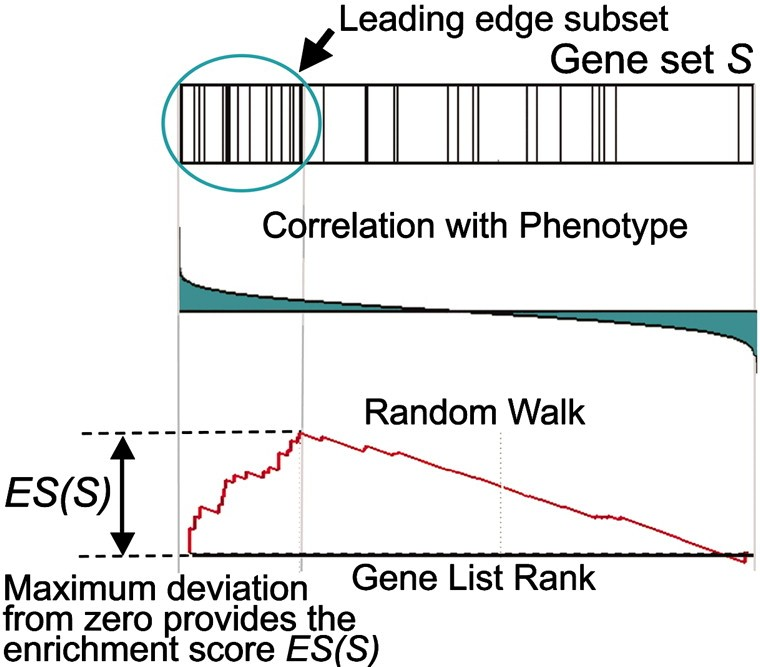

---
editor_options:
  markdown:
    wrap: 40
---
# Gene Set Enrichment Analysis

```{r setup, include=FALSE}
knitr::opts_chunk$set(warning = FALSE, 
        message = FALSE, echo = TRUE)
knitr::opts_chunk$set(tidy.opts = list(width.cutoff = 60), 
                      tidy = TRUE)
suppressPackageStartupMessages({
library(clusterProfiler)
library(fgsea)
library(enrichplot)
library(annotate)
library(ggplot2)
library(dplyr)
library(DOSE)
library(GOSemSim)
library(ViSEAGO)
library(topGO)
library(org.Sc.sgd.db)
library(org.Hs.eg.db)})
```
<<<<<<< HEAD

The .Rmd file for this chapter can be
found
[here](https://github.com/gurinina/omic_sciences/blob/main/12-GSEA.Rmd).
To begin learning about GO set
enrichmet analysis and the different
methods that can be utiliazed to preform
these analysis a good jumping off start
point is this Natural Protocols paper:

Pathway enrichment analysis and
visualization of omics data using
g:Profiler, GSEA, Cytoscape and
EnrichmentMap

Jüri Reimand, Ruth Isserlin, Veronique
Voisin, Mike Kucera, Christian
Tannus-Lopes, Asha Rostamianfar, Lina
Wadi, Mona Meyer, Jeff Wong, Changjiang
Xu, Daniele Merico and Gary D. Bader.

Pathway enrichment analysis helps
researchers gain mechanistic insight
into gene lists generated from
genome-scale (omics) experiments. This
method identifies biological pathways
that are enriched in a gene list more
than would be expected by chance. We
explain the procedures of pathway
enrichment analysis and present a
practical step-by-step guide to help
interpret gene lists resulting from
RNA-seq and genome-sequencing
experiments. The protocol comprises
three major steps: definition of a gene
list from omics data, determination of
statistically enriched pathways, and
visualization and interpretation of the
results. We describe how to use this
protocol with published examples of
differentially expressed genes and
mutated cancer genes; however, the
principles can be applied to diverse
types of omics data. The protocol
describes innovative visualization
techniques, provides comprehensive
background and troubleshooting
guidelines, and uses freely available
and frequently updated software,
including g:Profiler, Gene Set
Enrichment Analysis (GSEA), Cytoscape
and EnrichmentMap. The complete protocol
can be performed in \~4.5 h and is
designed for use by biologists with no
prior bioinformatics training.

Comprehensive quantification of DNA, RNA
and proteins in biological samples is
now routine. The resulting data are
growing exponentially, and their
analysis helps researchers discover
novel biological functions,
genotype--phenotype relationships and
disease mechanisms1,2. However, analysis
and interpretation of these data
represent a major challenge for many
researchers. Analyses often result in
long lists of genes that require an
impractically large amount of manual
literature searching to interpret. A
standard approach to addressing this
problem is pathway enrichment analysis,
which summarizes the large gene list as
a smaller list of more easily
interpretable pathways. Pathways are
statistically tested for
over-representation in the experimental
gene list relative to what is expected
by chance, using several common
statistical tests that consider the
number of genes detected in the
experiment, their relative ranking and
the number of genes annotated to a
pathway of interest. For instance,
experimental data containing 40% cell
cycle genes are surprisingly enriched,
given that only 8% of human
protein-coding genes are involved in
this process. In a recent example, we
used pathway enrichment analysis to help
identify histone and DNA methylation by
the polycomb repressive complex (PRC2)
as the first rational therapeutic target
for ependymoma, one of the most
prevalent childhood brain cancers3. This
pathway is targetable by available drugs
such as 5-azacytidine, which was used on
a compassionate basis in a terminally
ill patient and stopped rapid metastatic
tumor growth3. In another example, we
analyzed rare copynumber variants (CNVs)
in autism and identified several
significant pathways affected by gene
deletions, whereas few significant hits
were identified with case--control
association tests of single genes or
loci4,5. These examples illustrate the
useful insights into biological
mechanisms that can be achieved using
pathway enrichment analysis.
=======
The .Rmd file for this chapter can be found [here](https://github.com/gurinina/omic_sciences/blob/main/35GSEA.Rmd). To begin learning aobuto GO set enrichmet analysis and the different methods that can be utiliazed to preform these analysis a good jumping off start point is this Natural Protocols paper:

As a change a pace I thought we would go through this very helpful paper written...

Pathway enrichment analysis and visualization of omics data using g:Profiler, GSEA, Cytoscape and EnrichmentMap 

Jüri Reimand, Ruth Isserlin, Veronique Voisin, Mike Kucera, Christian Tannus-Lopes, Asha Rostamianfar, Lina Wadi, Mona Meyer, Jeff Wong, Changjiang Xu, Daniele Merico and Gary D. Bader. Pathway enrichment analysis helps researchers gain mechanistic insight into gene lists generated from genome-scale (omics) experiments. This method identifies biological pathways that are enriched in a gene list more than would be expected by chance. We explain the procedures of pathway enrichment analysis and present a practical step-by-step guide to help interpret gene lists resulting from RNA-seq and genome-sequencing experiments. The protocol comprises three major steps: definition of a gene list from omics data, determination of statistically enriched pathways, and visualization and interpretation of the results. We describe how to use this protocol with published examples of differentially expressed genes and mutated cancer genes; however, the principles can be applied to diverse types of omics data. The protocol describes innovative visualization techniques, provides comprehensive background and troubleshooting guidelines, and uses freely available and frequently updated software, including g:Profiler, Gene Set Enrichment Analysis (GSEA), Cytoscape and EnrichmentMap. The complete protocol can be performed in ~4.5 h and is designed for use by biologists with no prior bioinformatics training.

Comprehensive quantification of DNA, RNA and proteins in biological samples is now routine. The resulting data are growing exponentially, and their analysis helps researchers discover novel biological functions, genotype–phenotype relationships and disease mechanisms1,2. However, analysis and interpretation of these data represent a major challenge for many researchers. Analyses often result in long lists of genes that require an impractically large amount of manual literature searching to interpret. A standard approach to addressing this problem is pathway enrichment analysis, which summarizes the large gene list as a smaller list of more easily interpretable pathways. Pathways are statistically tested for over-representation in the experimental gene list relative to what is expected by chance, using several common statistical tests that consider the number of genes detected in the experiment, their relative ranking and the number of genes annotated to a pathway of interest. For instance, experimental data containing 40% cell cycle genes are surprisingly enriched, given that only 8% of human protein-coding genes are involved in this process. In a recent example, we used pathway enrichment analysis to help identify histone and DNA methylation by the polycomb repressive complex (PRC2) as the first rational therapeutic target for ependymoma, one of the most prevalent childhood brain cancers3. This pathway is targetable by available drugs such as 5-azacytidine, which was used on a compassionate basis in a terminally ill patient and stopped rapid metastatic tumor growth3. In another example, we analyzed rare copynumber variants (CNVs) in autism and identified several significant pathways affected by gene deletions, whereas few significant hits were identified with case–control association tests of single genes or loci4,5. These examples illustrate the useful insights into biological mechanisms that can be achieved using pathway enrichment analysis.

>>>>>>> 76c16d463fa273bd8d94966c4b198862d0b955e9

## Application to diverse omics data

This protocol uses RNA-seq data and
somatic mutation data6 as examples
because these data types are frequently
encountered. However, the general
concepts of pathway enrichment analysis
that we present are applicable to many
types of experiments that can generate
lists of genes, such as single-cell
transcriptomics, CNVs, proteomics,
phosphoproteomics, DNA methylation
and metabolomics. Most data types
require protocol modifications, which we
only briefly discuss here. With certain
data types, specialized computational
methods are required to produce a gene
list that is appropriate for pathway
enrichment analysis, whereas with other
data types, a specialized pathway
enrichment analysis technique is
required. 

## Pathway enrichment analysis methods

This protocol recommends the use of
g:Profiler and GSEA software for pathway
enrichment analysis. g:Profiler
analyzes gene lists using Fisher's exact
test and ordered gene lists using a
modified Fisher's test. It provides a
graphical web interface and access via R
and Python programming languages. The
software is frequently updated, and the
gene set database can be downloaded as a
[GMT file](http://biit.cs.ut.ee/gprofiler).
GSEA(http://software.broadinstitute.org/gsea)
analyzes ranked gene lists using
a permutation-based test. The software
typically runs as a desktop application.

Hundreds of pathway enrichment analysis
tools exist (reviewed in ref. Khatri,
P., Sirota, M. & Butte, A. J. Ten years
of pathway analysis: current approaches
and outstanding challenges. PLoS Comput.
Biol. 8, e1002375 (2012)), although many
rely on outof-date pathway databases or
lack unique features as compared to the
most commonly used tools; as such, we do
not cover them here. The following are
alternative free pathway enrichment
analysis software tools. Although we do
not cover these tools in our protocol,
we recommend the following, on the basis
of their ease of use, unique features or
advanced programming features.

## Comparison to alternative methods

(See paper for referenes) Enrichr(37):
This is a web-based enrichment analysis
tool for non-ranked gene lists that is
based on Fisher's exact test. It is easy
to use, has rich interactive reporting
features, and includes \>100 gene set
databases (called libraries), including
\>180,000 gene sets in multiple
categories. Functionality is similar to
that of the g:Profiler web server
described in this protocol.

[Camera(71)](https://bioconductor.org/packages/release/bioc/html/limma.html):
This R Bioconductor package analyzes
gene lists and corrects for inter-gene
correlations such as those apparent in
gene co-expression data. The software is
available as part of the limma package
in Bioconductor; (this is an advanced
tool that requires programming
expertise; Supplementary Protocol 3).
(similar to moast and roast)

[GOseq(72)](https://bioconductor.org/packages/release/bioc/html):
This R Bioconductor package analyzes
gene lists from RNA-seq experiments by
correcting for user-selected covariates
such as gene length; this is an advanced
tool that requires programming
expertise).

[Genomic Regions Enrichment of
Annotations Tool
(GREAT)(67)](http://bejerano.stanford.edu/great/public/html/):
In contrast to common methods that
analyze gene lists, GREAT analyzes
genomic regions such as DNA binding
sites and links these to nearby genes
for pathway enrichment analysis . See
'Application to diverse omics data'
section. PROTOCOL NATURE PROTOCOLS 492
NATURE PROTOCOLS \| VOL 14 \| FEBRUARY
2019 \| 482--517 \| www.nature.com/npro

## Visualization tools

This protocol recommends the use of
[EnrichmentMap](http://www.baderlab.org/Software/EnrichmentMap)
for pathway enrichment
analysis visualization to aid
interpretation. EnrichmentMap(16) is a
Cytoscape application that visualizes
the results from pathway enrichment
analysis and eases interpretation by
displaying pathways as a network in
which overlapping pathways are clustered
together to identify major biological
themes in the results.

Two alternative useful visualization
tools are:

[ClueGO(40)](https://apps.cytoscape.org/apps/cluego): 
This Cytoscape application
is conceptually similar to EnrichmentMap
and provides a network-based
visualization to reduce redundancy of
results from pathway enrichment
analysis. It also includes a pathway
enrichment analysis feature for analysis
of GO annotations using Fisher's exact
tests. However, it currently supports
only GO gene sets.

[PathVisio(49)](https://pathvisio.org/): 
This desktop application
provides a complementary visualization
approach to those of EnrichmentMap and
ClueGO. PathVisio enables the user to
visually interpret omics data in the
context of gene and protein interactions
in a pathway of interest.
[PathVisio](https://www.pathvisio.org)
colors pathway genes according to
user-provided omics data . This is the
main advantage of PathVisio as compared
to EnrichmentMap and ClueGO.


## Development of the protocol

This protocol covers pathway enrichment
analysis of large gene lists typically
derived from genomescale (omics)
technology. The protocol is intended for
experimental biologists who are
interested in interpreting their omics
data. It requires only an ability to
learn and use R programming language and
'point-and-click' computer software,
although advanced users can benefit from
the automatic analysis scripts we
provide as Supplementary Protocols 1--4.
We analyze previously published human
gene expression and somatic mutation
data as examples; however, our
conceptual framework is applicable to
analysis of lists of genes or
biomolecules from any organism derived
from large-scale data, including
proteomics, genomics, epigenomics and
gene-regulation studies. We extensively
use pathway enrichment analysis for many
projects and have evaluated numerous
available tools. The software
packages we cover here have been
selected for their ease of use, free
access, advanced features, extensive
documentation and up-to-date databases,
and they are ones we use daily in our
research and recommend to collaborators
and students. In addition, we have
provided feedback to the developers of
these tools, allowing them to implement
features we have needed in published
analyses. These tools are
g:Profiler(13), GSEA(14), Cytoscape(15)
and EnrichmentMap(16), all freely
available online:

[g:Profiler](https://biit.cs.ut.ee/gprofiler/)
[GSEA](http://software.broadinstitute.org/gsea/)
[Cytoscape](http://www.cytoscape.org/)
[EnrichmentMap](http://www.baderlab.org/Software/EnrichmentMap)

## Overview of the procedure

This section outlines the major stages
of pathway enrichment analysis. Pathway
enrichment analysis involves three major
stages. 1. Definition of a gene
list of interest using omics data. An
omics experiment comprehensively
measures the activity of genes in an
experimental context. The resulting raw
dataset generally requires computational
processing, such as normalization and
scoring, to identify genes of interest, 
For example, a list of genes differentially 
expressed between two groups of samples can 
be derived from RNA-seq data1. 2. Pathway 
enrichment analysis. A statistical method 
is used to identify pathways enriched in the 
gene list from stage 1, relative to what is 
expected by chance. All pathways in a given 
database are tested for enrichment in the gene 
list (see Box 2 for a list of pathway databases).
3. Visualization and interpretation of pathway 
enrichment analysis results. Many enriched 
pathways can be identified in stage 2, often 
including related versions of the same pathway. 
Visualization can help identify the main biological 
themes and their relationships for in-depth study 
and experimental evaluation.

Now we have our ranked file from and our gmt
file from this paper; ahd they are in the correct 
format to run `fgsea` from the `fgsea` package.
The .rnk file is from an RNA-seq experiment comparing
a mesochymal subtype to an immunureactive subtype ovarian 
cancer cells.  

`fgsea` requires a rank file and a pathway file in .gmt
format.


The .gmt format is a list, with pathways 
as names of the list, and genes as members of the
pathwyas -- or in other words GO terms and gene set
members. So lets look at that. The .gmt file is in a package
I made foar tahe course, `GOenrichmet`. First we read in the
rnk file:

```{r, eval = FALSE}
url <- "https://github.com/gurinina/omic.data/tree/master/csv/STable2_MesenvsImmuno_RNASeq_ranks.rnk"
filename <- "STable2_MesenvsImmuno_RNASeq_ranks.rnk"
library(downloader)
if (!file.exists(filename)) download(url, filename)

```

```{r ranked list}
prank = read.delim("STable2_MesenvsImmuno_RNASeq_ranks.rnk",stringsAsFactors = F,check.names = F)
library(GOenrichment)
pathways = hGOBP.gmt
pathways[1]
ranks = prank$rank
names(ranks) = prank$GeneName
wdup = which(duplicated(names(ranks)))
if(length(wdup) >0) ranks=ranks[-wdup]
```

The to run fgsea:

```{r run fgsea}
fgseaRes = fgseaSimple(pathways = hGOBP.gmt,stats=ranks,nperm=1000,maxSize = 200,minSize = 15)
```

```{r plot}
topPathwaysUp <- fgseaRes[ES > 0][head(order(pval), n=5), pathway]
topPathwaysDown <- fgseaRes[ES < 0][head(order(pval), n=5), pathway]
stringWINDOW = function(x, width = 25){
  strng = paste(strwrap(x,width = width), collapse="\n")
  strng
}
topPathways <- c(topPathwaysUp, rev(topPathwaysDown))
par(cex=0.5)
plotGseaTable(pathways[topPathways], ranks, fgseaRes,colwidths = c(5, 2, 0.8,0,1))

plotEnrichment(pathways[[topPathways[1]]], ranks)

```

Lets talk a little bit about how GSEA
works.

Steps: 1. Sort genes by log fold change, or
by any metric. 2. The score is calculated by walking 
down the list, increasing a running-sum statistic 
when a gene in the geneSet, and decreasing it when 
the gene is not. The magnitude of the increment 
depends on the correlation of the gene with the 
phenotype. The enrichment score (ES) is the maximum 
deviation from zero encountered in the random walk. 
A large ES means that genes in the set are
toward top of list. 3. Permute subject labels 
to calculate signficance of the score.


 Let's look at
the results. I wrote a function here to 
save time filtering and sorting outputs 
of GSEA unfriendly outputs:

```{r GSEA sort and tidy output}
mygseatidy = function(result){

nam=names(data.frame(result))
wnam = which(nam== "enrichmentScore")
if(length(wnam)>0) nam[wnam]="ES"
wnam = which(nam== "p.adjust")
if(length(wnam)>0) nam[wnam]="padj"
pres = data.frame(result) %>% filter(ES>=0)%>% arrange(desc(ES),padj,pathway)
nres = data.frame(result) %>% filter(ES<0)%>% arrange(ES,padj,pathway)
return(list(nres=nres,pres=pres))
}
```

let's look at the results:

```{r results}
fnegsea = mygseatidy(fgseaRes)$nres
fposgsea = mygseatidy(fgseaRes)$pres
```

lets compare this to the output run by
the GSEA desktop version of Cytoscape
covered in the paper. I would really
encourage you to run on your own, it's a
great interface and a lot of fun to work
with.

Here I am just reading in the
supplementarty tables of the negative
and positive GSEA results.

```{r, eval = FALSE}
url <- "https://github.com/gurinina/omic.data/tree/master/csv/STable8_gsea_report_for_na_pos.txt"
filename <- "STable8_gsea_report_for_na_pos.txt"
library(downloader)
if (!file.exists(filename)) download(url, filename)

url <- "https://github.com/gurinina/omic.data/tree/master/csv/STable9_gsea_report_for_na_neg.txt"
filename <- "STable9_gsea_report_for_na_neg.txt"

if (!file.exists(filename)) download(url, filename)
```

```{r}

ppos = read.delim(file = "STable8_gsea_report_for_na_pos.txt" ,stringsAsFactors = F,
                  check.names = F)

pneg = read.delim(file = "STable9_gsea_report_for_na_neg.txt" ,stringsAsFactors = F,
                  check.names = F)
ppos = ppos %>% arrange(desc(ES),`FDR Q-VAL`,TERM)
pneg = pneg %>% arrange(ES,`FDR Q-VAL`,TERM)

intersect(fposgsea$pathway[1:10],ppos$TERM[1:10])

intersect(fnegsea$pathway[1:10],pneg$TERM[1:10])
```

We have successfully found the GO
enrihchments. 

```{r}

table(fposgsea$padj < 0.05)
table(fnegsea$padj < 0.05)

```
There are over 700 terms for both the
positive and negative GSEA enrichments.
How do we make sense of them all?

You could look at just the most extreme
scores:

```{r}
### GO enrichment analysis
plot(ranks)
abline(v = 3500)
abline(v = 1500)
ego <- clusterProfiler::enrichGO(
        gene  = names(ranks)[1:1500],
        OrgDb = org.Hs.eg.db,
        keyType  = 'SYMBOL',
        universe = names(ranks),
        ont = "BP",
        pAdjustMethod = "BH",
        minGSSize = 15,
        maxGSSize = 200,
        pvalueCutoff  = 0.05,
        qvalueCutoff = 1)

goplot(ego)
dotplot(ego, showCategory=10) + ggtitle("positive enrichment")
sapGO <- godata('org.Hs.eg.db', keytype = "SYMBOL", ont="BP", computeIC=FALSE)
hx = pairwise_termsim(ego, semData = sapGO)
emapplot(hx, showCategory = 15)
```
We can also look at athe negative enrichment, or the repressed end:
```{r}
nego <- clusterProfiler::enrichGO(
        gene  = names(ranks)[13711:15211],
        OrgDb = org.Hs.eg.db,
        keyType  = 'SYMBOL',
        universe = names(ranks),
        ont = "BP",
        pAdjustMethod = "BH",
        minGSSize = 15,
        maxGSSize = 200,
        pvalueCutoff  = 0.05,
        qvalueCutoff = 1)

goplot(nego)
dotplot(nego, showCategory=10) + ggtitle("negative enrichment analysis")
sapGO <- godata('org.Hs.eg.db', keytype = "SYMBOL", ont="BP", computeIC=FALSE)
hx = pairwise_termsim(nego, semData = sapGO)
emapplot(hx, showCategory = 15)
```
Another approach is to collapse the terms by semantic similarity.
The package `ViSEAGO` combined with `topGO` allows you to do that.
Here is the setup:


```{r}
gene.df <- clusterProfiler::bitr(names(ranks), fromType = "SYMBOL",
toType = c("ENSEMBL", "ENTREZID"),
OrgDb = org.Hs.eg.db)

w=which(names(ranks)%in%gene.df$SYMBOL)

m=match(names(ranks)[w],gene.df$SYMBOL)
hanks=ranks[w]
names(hanks)=gene.df$ENTREZID[m]
sanks=names(hanks)[1:1500]

Bioconductor<-ViSEAGO::Bioconductor2GO()
myGENE2GO<-ViSEAGO::annotate(
"org.Hs.eg.db",
Bioconductor
)
library(data.table)
m1 = matrix(unname(hanks),ncol=1)
rownames(m1)=names(hanks)
t1=as.table(m1)
d1 = data.table(t1)
d1=d1[,-2]
names(d1)=c("Id","value")
hg<-runfgsea(
geneSel=d1,method="fgseaSimple",
gene2GO=myGENE2GO,
ont="BP",
params = list(
scoreType = "pos",
minSize= 15,
maxSize = 200,
nperm=10000)
)

hgres<-ViSEAGO::merge_enrich_terms(
Input=list(
"hg"
)
)
```

GO terms are then combined using
buiild_GO_SS, and semantic similarity
calculated using compute_SS_distances.
Finally, they are clustered based on
these similarities using
GOterms_heatmap.

```{r}
myGOs<-ViSEAGO::build_GO_SS(
gene2GO=myGENE2GO,
enrich_GO_terms=hgres
)
# compute all available Semantic Similarity (SS) measures
myGOs<-ViSEAGO::compute_SS_distances(
myGOs,
distance="Wang"
)
ViSEAGO::MDSplot(myGOs)
# GOterms heatmap with the default parameters
Wang_clusters_wardD2<-ViSEAGO::GOterms_heatmap(
    myGOs,
    showIC=TRUE,
    showGOlabels=TRUE,
    GO.tree=list(
        tree=list(
            distance="Wang",
            aggreg.method="ward.D2"
        ),
        cut=list(
            dynamic=list(
                pamStage=TRUE,
                pamRespectsDendro=TRUE,
                deepSplit=2,
                minClusterSize =2
            )
        )
    ),
    samples.tree=NULL
)

# Display the clusters-heatmap
ViSEAGO::show_heatmap(
    Wang_clusters_wardD2,
    "GOterms"
)

# Print the clusters-heatmap table
ViSEAGO::show_table(
    Wang_clusters_wardD2,
    "cluster_heatmap_Wang_wardD2.xls"
)
```

You can reiterate this until you get
down to even fewer GO terms:

```{r}

Wang_clusters_wardD3<-ViSEAGO::compute_SS_distances(
Wang_clusters_wardD2,
distance=c("max", "avg","rcmax", "BMA")
)
ViSEAGO::MDSplot(
Wang_clusters_wardD3,
"GOclusters"
)
Wang_clusters_wardD4<-ViSEAGO::GOclusters_heatmap(
Wang_clusters_wardD3,
tree=list(
distance="BMA",
aggreg.method="ward.D2"
)
)
ViSEAGO::show_heatmap(
Wang_clusters_wardD4,
"GOclusters"
)
```

But at this point, it looks like you've
now killed your signal. So lets go back
to the clustering step of the GO terms
and read in that file to see how that
may have helped us. It says its an excel
file, but experience has told me its
really a tab-delimited file.

```{r}
wang = read.delim("cluster_heatmap_Wang_wardD2.xls",stringsAsFactors = F,check.names = F)

names(wang)
names(wang) = gsub("condition.","",names(wang))
range(wang$size)

wang = wang %>% filter(size <= 200 & size >=15)

range(wang$padj)

wang = wang %>% filter(padj <= 0.05)

dim(wang)


spl = split(wang$term,wang$GO.cluster)

spl[1:5]

spl[6:10]
```
So that is useful for making sense of
a long list of GO terms, when writing 
a paper for example.

Here is another visualization from topGO
that is useful because you see the GO
hierarchy. For this I am goiong to use
the yeast data.

We use `compSCORE` and the `sampleFitdata`
to get some data to  play with. This function
returns a dataframe of designating
significant scores from the input matrix
of screening data based on the fitness
threshold cutoff.

The `bitr` function here is in the clusterProfiler
package, and is just an easy function for
translating gene names.

```{r}
Bioconductor<-ViSEAGO::Bioconductor2GO()
myGENE2GO<-ViSEAGO::annotate(
"org.Sc.sgd.db",
Bioconductor
)

dfsig = compSCORE(sampleFitdata,coln = 1, sig = 1)
head(dfsig)
table(dfsig$index)
wna = which(is.na(dfsig$score))
dfsig = dfsig[-wna,]

background = dfsig$gene
gene = dfsig$gene[dfsig$index ==1]
gene.df <- bitr(background, fromType = "GENENAME",
toType = c("ENSEMBL", "ENTREZID"),
OrgDb = org.Sc.sgd.db)

w=which(background%in%gene.df$GENENAME)
m = match(background[w],gene.df$GENENAME)


entrez = background[w]
entrez = gene.df$ENTREZID[m]

w=which(gene%in%gene.df$GENENAME)
m = match(gene[w],gene.df$GENENAME)

select = gene[w]
select = gene.df$ENTREZID[m]

BP=ViSEAGO::create_topGOdata(
geneSel=select,
allGenes=entrez,
gene2GO=myGENE2GO,
ont="BP",
nodeSize=5
)

classic<-topGO::runTest(
BP,
algorithm ="classic",
statistic = "fisher"
)
par(cex = 0.3)
showSigOfNodes(BP, score(classic), firstSigNodes = 5, useInfo = 'all')
```
Another way of  doing that is with goplot from the
enrichplot package


```{r}
ygene = dfsig$score
names(ygene) = dfsig$gene

gse <- clusterProfiler::gseGO(
geneList = ygene,
ont = "BP",
pvalueCutoff = 0.05,
keyType = "GENENAME",
eps = 0,
minGSSize = 5,
maxGSSize = 150,
verbose = TRUE,
OrgDb = "org.Sc.sgd.db",
pAdjustMethod = "BH",
by = "fgsea"
)
scGO <- godata('org.Sc.sgd.db', keytype = "GENENAME", ont="BP", computeIC=FALSE)

goplot(gse)
scGO <- godata('org.Sc.sgd.db', keytype = "GENENAME", ont="BP", computeIC=FALSE)

x = pairwise_termsim(gse, semData  = scGO, showCategory = 200)
emapplot(x, showCategory = 20)
p2 <- treeplot(x, hclust_method = "average")

upsetplot(gse)
dotplot(gse, showCategory = 5, split = ".sign") + facet_grid(. ~.sign)
cnetplot(gse, categorySize="pvalue", foldChange=names(ygene)[1:10], showCategory = 3)
ridgeplot(gse, showCategory = 10) + labs(x = "enrichment distribution")
gseaplot(gse, by = "all", title = gse$Description[7], geneSetID = "GO:0006526")


### GO enrichment analysis
ego <- clusterProfiler::enrichGO(
        gene  = names(ranks)[1:1500],
        OrgDb = org.Hs.eg.db,
        keyType  = 'SYMBOL',
        universe = names(ranks),
        ont = "BP",
        pAdjustMethod = "BH",
        minGSSize = 15,
        maxGSSize = 200,
        pvalueCutoff  = 0.05,
        qvalueCutoff = 1)

goplot(ego)
### 'A universal enrichment analyzer'
# henrich = clusterProfiler::enricher(
#   gene = names(ranks)[1:1500],
#   TERM2GENE = hterm2gene,
#   TERM2NAME = hterm2name,
#   universe = names(ranks),
#   minGSSize = 15,
#   maxGSSize = 200,
#   qvalueCutoff = 1,
#   pvalueCutoff = 0.05,
#   pAdjustMethod = "BH"
# )

## GSEA
hse <- clusterProfiler::gseGO(
  geneList = ranks,
  ont = "BP",
  keyType = "SYMBOL",
  eps = 0,
  minGSSize = 15,
  maxGSSize = 200,
  pAdjustMethod = "BH",
  pvalueCutoff = 0.05,
  verbose = TRUE,
  OrgDb = "org.Hs.eg.db",
  by = "fgsea"
)
goplot(hse)
sapGO <- godata('org.Hs.eg.db', keytype = "SYMBOL", ont="BP", computeIC=FALSE)
hx = pairwise_termsim(hse, semData = sapGO)
px <- treeplot(hx)
p2<- treeplot(hx, hclust_method = "ward.D2")

```
Let's see how well these agree


So we can see overall that there is not very
good agreement between these functions.
Why? We'd have to look into the package
daetails, but the major reason is
likely to be the due to the differences
in geneSets. I did spend soome time
looking into the details. For example, 
the runfgsea in the ViSEAGO is the same function
as the fgsea function in fgsea and in clusterProfiler
gseGO, but the GO geneSets that they retrieve
are all different. fgsea uses the user input,
ViSEAGO uses a variety of databases depending on
how you define your `myGENE2GO` function, and
gseGO uses AnnotationDbi. The other point to make
is that people often carefully filter their
GO geneSets. For example, every gene assigned to
a GO term is associated with an evidence code.

Let's look at a quick example. Using `AnnotationDbi' and
the `select` function, we can pull down the GO annotaations
by querying the yeast databasea `org.Sc.sgd.db`.

```{r}


yanno = AnnotationDbi::select(org.Sc.sgd.db,
  keys=dfsig$gene,columns=c("ORF","GENENAME","GOALL",
  "ONTOLOGYALL"),keytype="GENENAME")
names(yanno)


```
So right away we want to filter for "BP",biological process,
and we probably want to get the TERMs for the go ids. One
way to do that is to use the annotate package.

```{r}
yanno = yanno %>% filter(ONTOLOGYALL == "BP")
library(annotate)
gT = getGOTerm(yanno$GOALL)
gT = gT$BP
w=which(yanno$GOALL%in% names(gT))
yanno$term=NA
m=match(yanno$GOALL[w],names(gT))
table(is.na(m))
yanno$term[w]=toupper(gT)[m]
wna=which(is.na(yanno$term))
u=unique(yanno$GOALL[wna])
u[1:5]
```
If you look these terms up in the go ontology website
[amigo](http://amigo.geneontology.org/amigo/landing) you'll find
that most of them are obsolete and have been retired. So these
GO terms are constantly changing -- in fact several of these
are in my GO gene sets, as well as in the GO gene sets of the
functions we have been using. Not to even mention what members in
each set may have changed. 

Let's look at the numbers.
```{r}

nrow(yanno)
nrow(yanno)/length(unique(yanno$GENENAME))

```


Nearly 100 annotations/gene! But they are likely not evenly
distributed. Rather you have some genes with many terms, and
some with very few.

LEt's look at the evidence codes.

```{r}
yanno = yanno[-wna,]
tmp = yanno %>% group_by(GENENAME)%>% count(terms= length(term))
hist(tmp$n)
```
So clearly one of the most important things to
remember about geneSet analysis is that
geneSets are constantly being updated.
Many of the R packages we are using, I
have noticed! don't update their files
to reflect this. Therefore the safest
way to ensure you are using the most
up-to-date file is to download it from
the GO ontology consortium website [Gene
Ontology
Consortium](http://current.geneontology.org/products/pages/downloads.html).
The GO ontology constortium updates
their files constantly and have all the
model organism geneSets. Another good
sourcce for Human, woodchuck, rat and
mouse data is Gary Bader's at the
Univerisity of Toronto's website [Gary
Bader Enrichment Map Gene
Sets](http://baderlab.org/GeneSets).
There they have serveral versions of the
gmt files separated into GO ontologies,
plus/minus IEAs, +/ pathway annotations
etc. If you publish a paper, you always nee to cite
the source and the date of down load. The files on 
the GO ontology web site are provided as .GAF files.

Go through GAF file: 1. filter for
ontology: most commonly people use BP 2.
filter for evidence codes: most
commonly, IEA and other
computational codes are filtered out,
but it depends on the organism -- if the
organism is not well annotated, you may
want to choose to leave it in 3.
sometimes people filter for source or
whatever process you prefer, fiORFs,
duplicated genes. filter for IEA.

Ok, let's move on. Here it would be very nice
to have some handy visualization tools
so that we could more easily summarize
the similarities and differences between
these results. 


Finally, I'm going to show you a GO
enrichment tool that we developed in our
lab. I made a paakage for the course that has
all the functions and everything you need.

```{r}
library(GOenrichment)
ls("package:GOenrichment")
```

The GO enrichment itself is basically
over representation analysis, so we need a listdon't need to go over that
bit in detail.

Heere, instead of using a ranked
list however, to run the GO enrichment we use a list of
"significant genes" and compared it to a
set of background genes, instead of
using a ranked list. This mode of running a GO
enrichment is called an over-representation
analysis. This decision is
very much based on our platform. Our
platform is a chemogenomics assay and
the uniqueness of our assay is that
unlike RNA expressioin, for example, the
assay returns a ranked list of genes,
but in this case the ranked list 
is directly informative of the
importance of each gene to the
biological question. In this case, the
biological question is how important is
that gene for resistance to a particular
compound or drug? In expression, a
larger fold change in expression in
response to perturbation does not
necessarily imply that that gene is more
important for adaptation or resistance
to the change in perturbation, but in
our chemogenomic assay, a larger change
in resistance, in this case measured as
a change in fitness, or growth does tell
us exactly that. So that is why we opt
not to use the ranked list approach.
There is still the issue of where to
draw the cutoff, but we have overcome
that after years of experience with the
assay and being intimately familiar with
the level of sensitivity and what level
of sensitivitiy we are comfortable with
calling statistically significant.

So because we know the level of that significance
is approximately one, we can run the GO enrichment.
So we need all the parameters. `bp_input` is the
geneSets and `go_input` just carries along the GOIDs
for the geneSets since they are in .gmt formet, which
we saw with fgsea. mat is the screening data, coln is
the column of the matrix that has the sample of interest,
sig is the significance threshold, fdrThresh is the FDR
threshold, which we set fairly high as it is quite 
stringent.

```{r}
go_input = dfGOBP
bp_input = yGOBP.gmt

goresp = runGORESP(fdrThresh = 0.2,curr_exp = colnames(sampleFitdata)[1], 
      mat = sampleFitdata, coln = 1, sig = 1, bp_input = bp_input,go_input = go_input)
```
Lets look at what is returned.

There is an enrichInfo data.frame, and an edgeMat.
enrichInfo has all the enriched terms, their FDR scores, overlapping genes, etc.
Other columns are important for the visualization which we'll get to.
edgeMat has information that links the nodes to eachother depending
on the overlap between terms. edgeMat is strictly for visualiztion.
The overlappCoeff, or overlap between terms gets translated into an edge width,
the larger the overlap, the thicker the edge. We'll see this later.

```{r}
goresp$enrichInfo[3,]

goresp$edgeMat[1,]
```
Ok. Before we get back into that I just
want to go over what GO enrichment does.
So for a GO enrichment with a
significant set of genes and a
background list we can model the
association between genes and GO class
using a hypergeometric distribution. The
classical example for the hypergeometric
is the ranomdly selection of k balls in
an urn containing N totalballs, m white
and n black balls, and the observation
that the selection contains "x" marked
ball.

To illustrate the way to perform the
hypergeometric test, we will re-analyze
walk through from scratch one of the
enrichment results from the test we just
performed.

So first lets look at the parameters
that were used in `runGORESP` to calculate
the probability of a significant gene
belonging to a particular geneSet. So
within `runGORESP`, there is annother
function called `compSCORE`, that we've
seen already. Lets use it again here.

```{r}

dfsig = compSCORE(sampleFitdata,coln = 1, sig = 1)
head(dfsig)
table(dfsig$index)

```

There are often fitness scores that have
NA values, so lets check for that right
away and get rid of those.

```{r}
wna  = which(is.na(dfsig$score))
length(wna)
dfsig = dfsig[-wna,]
table(dfsig$index)
```

We define the parameters of the
hypergeometric test in the following
way:

N = total number of balls = total number
of genes in the universe. This means all
the gehes with GO annotation.

m the number of white balls in the
urn,i.e. the number of genes in the
geneSet.

n the number of black balls in the urn

k the number balls drawn from the urm

Lets start with N

N = total number of genes in the screening matrix 

So we need to know how many of the
significant genes have a GO annotation:

```{r}
N = nrow(dfsig)

# moving forward we should also filter out geneSets
# this is done inside the function:
yGOBP = lapply(yGOBP.gmt,intersect,dfsig$gene)

```

The second parameter:

m = white balls, take thise to mean
genes in the geneSet of interest i.e.
total number of genes annotated for the
selected GO term (ARGININE BIOSYNTHETIC
PROCESS).

```{r}
w = which(names(yGOBP)=="ARGININE BIOSYNTHETIC PROCESS")
yGOBP[[w]]
m = length(yGOBP[[w]])
m
n = N-m
n
```

N = 4797 m = 9 n = N−m = 3806 #number of
blackballs, i.e. the number of genes
that have annotation distinct \# from
the GO term (ARGININE BIOSYNTHETIC
PROCESS).

k = random selection of k balls = size
of the query selection, i.e. number of
genes passing the significance threshold
this comes from out score data.frame

```{r}
table(dfsig$index)
k = sum(dfsig$index == 1)
k

```

So from here we can see that k = 191,

the size of the query set.


Finally, x = number k balls (query set)
that overlap with the m, the ARGININE
BIOSYNTHETIC PROCESS gene set

```{r}
gene = dfsig$gene[dfsig$index==1]
arg = yGOBP$`ARGININE BIOSYNTHETIC PROCESS`
int = intersect(arg,gene)
x = length(int)
x
```

We can use the phyper function, which gives the
cumulative probability at a specified value:

```{r}
phyper(q = x-1, m, n, k, lower.tail = FALSE)
goresp$enrichInfo$P[3]
goresp$enrichInfo$nOverlap[3]
```

This is equivalent to setting up a
contingency table and doing a Fisher's
exact test:

```{r contingency}

  
## q = length overlap-1 #successes in querySet
## m is the number of successes in population = geneSetsize 
## success in population
## n = N - m
## k is length of queryset
## N = universe, nrow in  matrix
## Prepare a two-dimensional contingency table
contingency.table <- data.frame(matrix(nrow=2, ncol=2))
rownames(contingency.table) <- c("significant","not significant")
colnames(contingency.table) <- c("in geneSet","not in geneSet")
 
## Assign the values one by one to make sure we put them in the right
## place (this is not necessary, we could enter the 4 values in a single instruction).
contingency.table[1,1] <- x 
## Number of marked genes in the selection
contingency.table[1,2] <- k - x 
## Number of non-marked genes in the selection
contingency.table[2, 1] <- m - x 
## Number of marked genes outside of the selection
contingency.table[2, 2] <- n - (k - x) ## Number of non-marked genes in the selection
contingency.table
```
From here we can do a fisher's test
```{r}
fish = fisher.test(contingency.table , alternative = "greater")
 
fish$p.value

```

We can fill this table out by adding the margins.

```{r}
(contingency.row.sum = apply(contingency.table, 1, sum))
(contingency.col.sum = apply(contingency.table, 2, sum))
## Create a contingency table with marginal sums
exp.contingency.table <- cbind(contingency.table, contingency.row.sum)
exp.contingency.table <- rbind(exp.contingency.table, apply(exp.contingency.table, 2, sum))
names(exp.contingency.table) <- c(names(contingency.table), "total")
rownames(exp.contingency.table) <- c(rownames(contingency.table), "total")
print(exp.contingency.table)
```

I find that this is a useful way to
grasp the phyper function, where it's
easy to get confused about what the
balls are and what's marked and what's
unmarked. This lays it out very clearly.
Contingency tables also really shine at
highlighting joint probabilities because
each cell displays the number of times
events occurred together. Those cell
values are the joint events for the
numerator. The grand total is the number
of outcomes for the denominator.

Under the hypothesis of independence, we
would expect to find the genes
distributed randomly within the table,
but with the same marginal row and
column sums. We can therefore estimate
the expected number of elements in each
cell by taking the product of the total
entries in the row and column, and
dividing it by the total number of genes
because these joint probabilities must
be additive under the laws of
independence. If you really want to test
for independence these estimates could
then be used to test in a chisq.test.

OK, lets move on.

Just for grins, lets see how the well
the human data agrees if we run a GO
enrichment test vs a GSEA. Instead of
ranks, we'll have to set a threshold.
Lets use a threshold

```{r}
library(GOenrichment)

mat = cbind(ranks,ranks)
hresp = GOenrichment::runGORESP(fdrThresh = 0.05,mat=mat,
    coln=1,curr_exp = colnames(mat)[1], sig = ranks[1500], 
    bp_input = hGOBP.gmt,go_input = NULL,minSetSize = 15, 
    maxSetSize = 200)
intersect(fposgsea$pathway[1:20],hresp$enrichInfo$term[1:20])
```
Looks familiar right? That's because we used the same
geneSets.

So now we're going to use the results
from the hypergeometric tests to do some
visualization and construct a network of
GO enrichments. So right now our data is
in the form of an enrichment dataframe
with lots of nice annotation -- FDR
values, geneSetSize and all those nice
details we just looked at.

The other piece of the data that got
generated in this "runGORESP" function
was an edge matrix, and I am not going
to go through all the details here, you
can go through the code on your own
time, its pretty straight forward.
Basically what it does is it takes all
of the enriched geneSets and it walks
throgh them systematically comparing all
pairwise combinations to calculate the
overlap coefficient between them. So
here again is yet another method for
simplifying the output and trying to
minimize the rendundancy between terms.
We saw it with the collapsePathways in
fgsea, and the packages GOSemSim, DOSE,
enrichplot and meshes have implemented a
variety of tools based on semantic
similarity of genes or gene products
using [Gene Ontology, Disease Ontology
and Medical Subject Headings]
(<https://yulab-smu.top/biomedical-knowledge-mining-book/index.html>).
The GO semanitic similarities are
similar to GO slim methods, where child
GO terms are collapsed into more general
terms, but as far as I can tell the data
is not that easy to manage.

Visualization:

```{r}

#####
vis = visSetup(enrichInfo = goresp$enrichInfo,edgeMat = goresp$edgeMat)
############
# generates a network based on node and edge parameters
############

runNetwork(nodes = vis$nodes,edges=vis$edges)
```

Lets do the same for the human results:

```{r}
vis = visSetup(hresp$enrichInfo,hresp$edgeMat)
runNetwork(vis$nodes,vis$edges)
```
The map is very busy, but interestingly you can see 
that there is a major cluster. The major node in this
cluster is defined by HALLMARK_EPITHELIAL_MESENCHYMAL_TRANSITION,
then there are some other large nodes, EXTRACELLULAR MATRIX ORGANIZATION,
EXTRACELLULAR STRUCTURE ORGANIZATION. Because these pink nodes
are all linked by edges, their GO terms overlap by at least 50%.
The HALLMARK_EPITHELIAL_MESENCHYMAL_TRANSITION is related  to cancer.
Cancer cells undergo epitelial mesenchymal transition (EMT) 
-- a loss of polaritiy and cell-cell adhesion and a gain of migratory 
and invasive properties -- during metastasis.
properties. So this analysis really helped clarify the positive
end of the GSEA analysis. We could do the same for the negative end
by just negating the values.

```{r}
library(GOenrichment)

mat[,2]= -mat[,2]
mat = mat[order(mat[,2],decreasing = T),]

hresp = GOenrichment::runGORESP(fdrThresh = 0.05,mat=mat,
    coln=2,curr_exp = colnames(mat)[2], sig = mat[1500,2], 
    bp_input = hGOBP.gmt,go_input = NULL,minSetSize = 15, 
    maxSetSize = 200)
intersect(fnegsea$pathway[1:20],hresp$enrichInfo$term[1:20])
```

```{r}
vis = visSetup(hresp$enrichInfo,hresp$edgeMat)
runNetwork(vis$nodes,vis$edges)
```
It's diffficult to see what's in the cluster. But it
is in the data:

```{r}
table(hresp$enrichInfo$cluster)
w = which(hresp$enrichInfo$cluster == "#9900FF")
hresp$enrichInfo$term[w]

```
You could imagine modifying this function osuch that
it doesn't rely on a significance cutoff and instead
tests iteratively down the ranked list of genes akin 
to GSEA until it reaches the maximum GO enrichment
and then stops there. It would still be an over representation
analysis, it just wouldn't rely on an arbitrary significance
cutoff. I've tried this and it works quite well, but
it takes a lot of memory as you can imagine.

Ok, moving on. So there are lots and lots of GO enrichment 
and GSEA packages, and lots of different algorithms. Most 
use GO enrichment or GSEA. We talked about some of them.

enrichGO, gseGO, enricher, goana,
go_enrich, gost etc. Over representation
analysis: goprofiler2, clusterProfiler,
GOfuncR, limma, goseq, topGO GSEA:
fgsea, GSEA, ViSEAGO, RGSEA 

For an expression experiment, to
generate a rank file one should add
these columns: 1. sign (sign of logFC)
2. logP = -log10(Pvalue) 3. combine
these into a score and include the gene
name; such that
a large logP implies a highly
significant gene, and the sign just
reflects the direction of that logFC.


