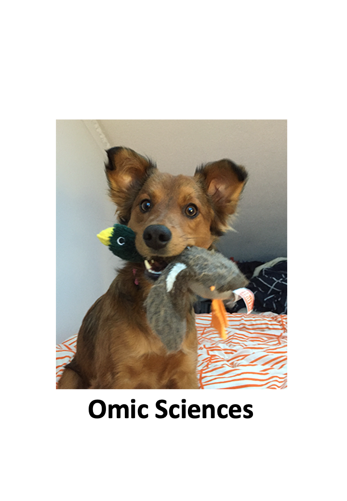

--- 
title: "Omic Sciences"
author: "Guri Giaever"
date: "2022-08-05"
bibliography: [book.bib, packages.bib]
biblio-style: apalike
cover-image: "koos1.png"
description: A better understanding of biology and human health can create breakthroughs in disease treatment and introduces the prospect of personalized medicine. This course will begin with an introduction and review of the general principals of genomics and molecular biology. You will then explore in detail the key genomic technologies and computational approaches that are driving advances in prognostics, diagnostics, and treatment. Learn how scientists sequence, assemble, and analyze the function and structure of genomes. Explore methods for determining the heritability of traits & diseases by studying the larger population, and learn how gene identification can help identify targets for therapeutic intervention. Explore how you could use personal genomics to manage your health.  
link-citations: yes
github-repo: gurinina/omic_sciences
url: https\://bookdown.org/ggiaever/omic_sciences/
site: bookdown::bookdown_site
output: bookdown::gitbook
documentclass: book
---
# Welcome to Omic Sciences!

This course will cover several of the statistical concepts and data
analytic skills needed to succeed in data-driven life science
research as it relates to genomics and the omic sciences.

We start with one of the most important topics in statistics and in
the life sciences: statistical inference. Inference is the use of
probability to learn population characteristics from data to predict outcomes. 
A typical example is deciphering if two groups (for example, cases versus controls) 
are different on average. Specific topics covered include the t-test,
confidence intervals, association tests, and statistical power. 
We make use of the Central Limit and we will learn how to compute p-values 
and implement basic data analyses. This will form the foundation
for the analytic techniques discussed throughout the course. 
Throughout the course we will describe visualization techniques 
in the statistical computer language *R* that
are useful for exploring new high throughput datasets. For example, we will use 
these to learn when to apply robust statistical techniques.

We will then move on to an introduction to linear models and matrix
algebra. We will explain why it is beneficial to use linear models to
analyze differences across groups, and why matrices are useful to
represent and implement linear models. We continue with a review of
matrix algebra, including matrix notation and how to multiply matrices
(both on paper and in R). We will then apply what we covered on matrix
algebra to linear models. We will learn how to fit linear models in R,
how to test the significance of differences, and how the standard
errors for differences are estimated. 

For the bulk of the course we cover topics related to genomics and
high-dimensional data. Specifically, we describe multiple testing,
error rate controlling procedures, exploratory data analysis for
high-throughput data, p-value corrections and the false discovery
rate. Here we will cover experimental techniques used in genomics including
RNA-seq, Chip-chip, variant and DNA-methylation analysis. 

We will cover the concepts of distance and dimension reduction. We
will introduce the mathematical definition of distance and use this to
motivate the singular value decomposition (SVD) for dimension
reduction and multi-dimensional scaling. Once we learn this, we will
be ready to cover hierarchical and k-means clustering. We will follow
this with a basic introduction to machine learning.

We end by learning about batch effects and how component and factor
analysis are used to deal with this challenge. In particular, we will
examine confounding, show examples of batch effects. We will end with complete
walk throughs of examples of the analysis of RNA-seq, chip-chip and 
DNA-methylation data.

## How Is This Course Different?

While statistics textbooks focus on mathematics, this book focuses on
using a computer to perform data analysis. Instead of explaining the
mathematics and theory, and then showing examples, we start by stating
a practical data-related challenge. This book also includes the computer code that 
provides a solution to the problem and helps illustrate the
concepts behind the solution. By running the code yourself, and seeing
data generation and analysis happen live, you will get a better
intuition for the concepts, the mathematics, and the theory. 
For example, this Rmd code is available [here](https://github.com/gurinina/omic_sciences/blob/main/index.Rmd).

We focus on the practical challenges faced by data analysts in the
life sciences and introduce mathematics as a tool that can help us
achieve scientific goals. Furthermore, throughout the book we show the
R code that performs this analysis and connect the lines of code to
the statistical and mathematical concepts we explain. All sections of
this book are reproducible as they were made using *R markdown*
documents that include R code used to produce the figures, tables and
results shown in the book.

